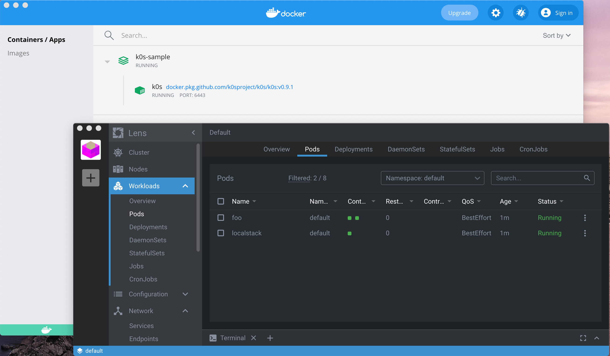
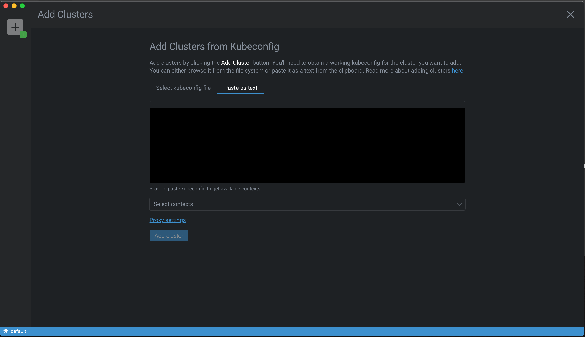

# README
This repository provides some samples for k8s manifets.
* k0s on docker-compose (playground for k8s)
* Lens (k8s IDE)
* localstack on k8s (AWS mocking framework)





TBD

```
master:k0s-sample$ kubectl get all
NAME             READY   STATUS    RESTARTS   AGE
pod/foo          2/2     Running   0          5m15s
pod/localstack   1/1     Running   0          5m16s

NAME                 TYPE        CLUSTER-IP   EXTERNAL-IP   PORT(S)    AGE
service/kubernetes   ClusterIP   10.96.0.1    <none>        443/TCP    31h
service/localstack   ClusterIP   10.96.10.1   <none>        4566/TCP   5m15s
```

## Getting Started
```
$ docker-compose up -d
...
```

TBD
